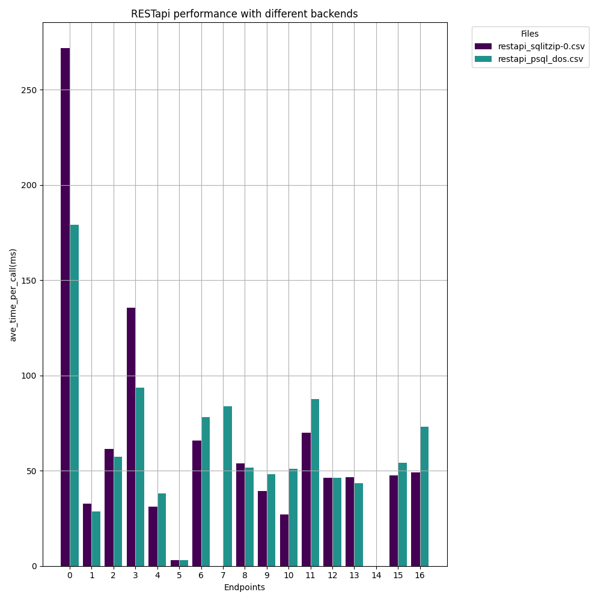

# aiida-profiling

This repository is a beta that profiles various aspects of `aiida-*` repositories.

## Disclaimer

Please note that this repository is very **experimental** and the results may not always make sense.
The profiling results obtained from this repository do not represent the actual behavior of the `aiida-*` repositories or any other related software. Use the results at your own discretion.

**Note:** I'm not sure if I'll keep this repo alive. For the moment is more convenient this way, than manually handing files to my colleagues.

## Performance Graphs 

### The performance of two different trasnport plugin of AiiDA, namely `SSH` and `FirecREST`.

The profiler script (in `/firecrest/profiler.py`) uses `InjectTool` to patch set of functions (`func_to_profile_transport` and `func_to_profile_scheduler`) in the source code with a wrapper. Later during the execution the listed function will be profiled.
Once done, the patched source code will revert back to the original code, even in the event of an exception.

The results are written to CSV files (`SSH.csv` and `Fire.csv`), with columns for the number of jobs and the total execution time.
  

For more detailed of bottle neck please have a look directly at the `_combined_sortby_...profile` files 

### restapi

| Endpoint | Average Time per Call (ms) |
| --- | --- |
| 0 |  /api/v4/nodes |
| 1 |  /api/v4/nodes/download_formats |
| 2 |  /api/v4/nodes/full_types |
| 3 |  /api/v4/nodes/page/1?perpage=25&full_type="data.%|"&orderby=-ctime |
| 4 |  /api/v4/users |
| 5 |  /api/v4/server |
| 6 |  /api/v4/nodes/full_types_count |
| 7 |  /api/v4/nodes/statistics |
| 8 |  /api/v4/nodes/<id>?attributes=true |
| 9 |  /api/v4/nodes/<id>/links/incoming |
| 10 |  /api/v4/nodes/<id>/links/outgoing |
| 11 |  /api/v4/nodes/<id>/links/tree?in_limit=10&out_limit=10 |
| 12 |  /api/v4/nodes/<id> |
| 13 |  /api/v4/nodes/<id>/download?download_format=chemdoodle |
| 14 |  /api/v4/nodes/<id>/download?download_format=cif |
| 15 |  /api/v4/nodes/<id>/download?download_format=xsf |
| 16 |  /api/v4/nodes/<id>/download?download_format=xyz |

## End Performance Graphs
