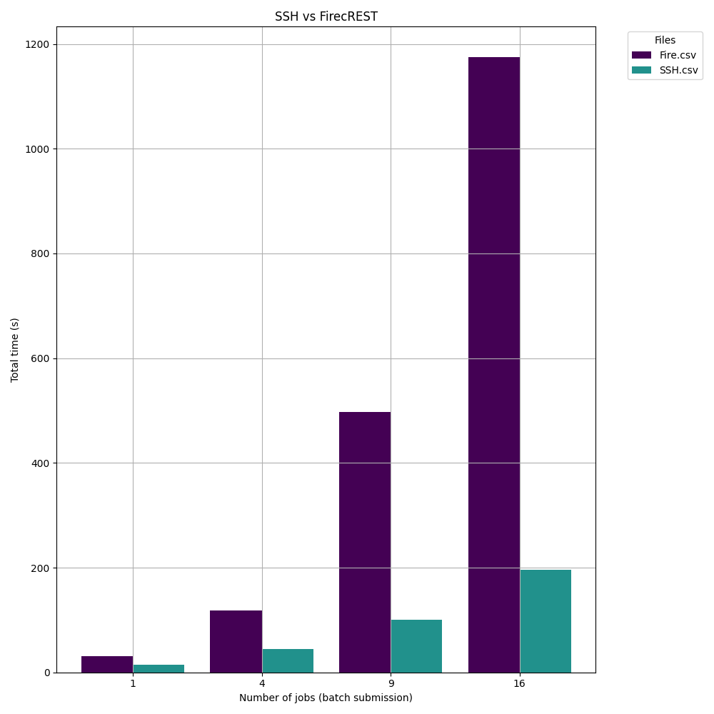

### The performance of two different trasnport plugin of AiiDA, namely `SSH` and `FirecREST`.

The profiler script (in `/firecrest/profiler.py`) uses `InjectTool` to patch set of functions (`func_to_profile_transport` and `func_to_profile_scheduler`) in the source code with a wrapper. Later during the execution the listed function will be profiled.
Once done, the patched source code will revert back to the original code, even in the event of an exception.

The results are written to CSV files (`SSH.csv` and `Fire.csv`), with columns for the number of jobs and the total execution time.
  

For more detailed of bottle neck please have a look directly at the `_combined_sortby_...profile` files 